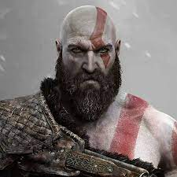

# Bem-vindo à minha página

_Acompanhe alguns **tópicos** a seguir:_

## Funcionalidades da página

**Função 1** (Negrito com asteriscos)  
__Função 2__ (Negrito com underlines)  
_**Função 3**_ (Negrito e Itálico com  1 underline e 2 asteriscos)

###### Problemas conhecidos

*Problema 1* (Itálico com asterisco)  
_Problema 2_ (Itálico com underline)  
_**Problema 3**_ (Itálico e negrito com 1 underline e 2 astesriscos)

### Pendências a serem desenvolvidas no game

* Ambiente/Espaço físico
    * Calcular área limite
    * Verificar por bugs de cenário
* Trilha sonora
* Dublagem

### Personagens a serem criados

1. Kratos
    1. Dano físico
    2. Curta distância
2. Atreus
    1. Dano mágico
    2. Longa distância

### Imagem local

### Imagem Externa

### Parcerias 

* [Google](https://www.google.com)
* [Professor Matheus Battist](https://www.github.com/matheusbattisti)
* [] (https://www.youtube.com/fallenINSIDER)